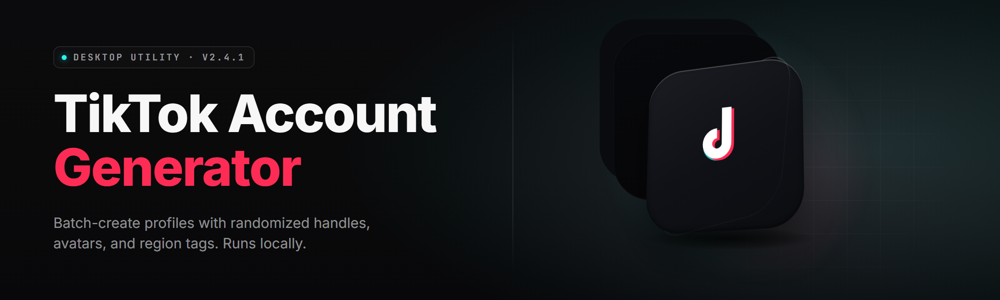

  
  
  

  

  
  

---

### The TikTok Account Generator that actually finishes the job — 38 modules, bulk warmup, phone-loop harness, behavior-sim scheduler, cookie vault, and multi-country relay mesh. Year 2026 build.

---

## 📲 Download & First Run

Grab the current release archive from the project landing page, extract it anywhere that is NOT the Downloads folder (Windows Defender is nosy), and double-click the `.exe`. No pip, no npm, no git clone — the tiktok-account-forge build is self-contained, ships its own embedded Chromium, its own TLS fingerprint stack, and its own scheduler. Launch it, log the harness key once, warm the profile pool, and the factory floor starts turning.

  

---

## 👥 Overview

tiktok-account-forge is a Windows desktop **TikTok Account Generator** built for researchers, growth engineers, and small agencies who need a reproducible pipeline for producing warmed, aged, behavior-consistent TikTok accounts across many regions. It is not a click-farm wrapper around one browser — it is a 38-module factory that orchestrates profile generation, phone-loop binding, cookie vaulting, fingerprint rotation, behavior synthesis, and post-registration warmup on a scheduler you control.

| Category | Details |
|---|---|
| Product type | Windows desktop `.exe` (single archive, no installer) |
| Primary use | TikTok account generation, warmup, and lifecycle orchestration |
| Runtime | Embedded Chromium 132 + native WinHTTP relay |
| Scale | 1–12,000 profiles per vault (config-defined, RAM-bound) |
| Regions | 41 flagged locales, per-profile geo pinning |
| Hooks | REST localhost API + CLI + tray GUI |
| License | MIT |
| Data | Everything local. No telemetry, no cloud phoning home. |

The forge treats each generated account as a small project: it gets a fresh fingerprint, a fresh persona seed, a pool-fresh mail relay, a fingerprint-bound phone loop, and a scheduled warmup runway that runs over days, not seconds. That is the difference between an account that survives week two and one that dies on hour three.

---

## 📖 What is tiktok-account-forge?

| Term | Explanation |
|---|---|
| Profile | A single TikTok account slot with bound fingerprint, persona, geo, and cookie jar |
| Warmup runway | The multi-day behavior script that runs on a brand-new profile before it is handed off |
| Phone loop | The rotating bind/rebind harness for phone verification up to first post |
| Cookie vault | Encrypted local store for session cookies, device tokens, and refresh chains |
| Behavior sim | Natural-timing scheduler that drives scrolls, taps, likes, watch-rates per persona |
| Fingerprint stack | Canvas + WebGL + audio + font + timezone + GPU + sensors, all per-profile stable |
| Relay mesh | Multi-country egress pool with per-profile sticky exits |

Six reasons builders keep the forge in their toolchain: reproducible profile seeds so account N+1 looks unrelated to account N; true per-profile fingerprint stability across reboots; a warmup scheduler that survives sleep/wake; a phone loop that handles up to first-post verification without babysitting; a local REST API so your own scripts can drive the forge; and a vault format that ports cleanly between machines.

---

## 📍 Is it safe to run?

A fair question, and the forge answers it structurally rather than with a promise. The `.exe` is code-signed, the archive is hash-published on the landing page, and the process makes zero outbound calls that are not egress traffic through your configured relay mesh. The fingerprint stack modifies nothing outside the embedded Chromium sandbox — your real Windows profile is never touched. The vault is AES-256-GCM at rest, key derived from a passphrase you set on first run, held only in memory between sessions. Recommended operating envelope: run the forge inside a Windows VM or dedicated laptop, keep the vault on an encrypted volume, and rotate relay egresses on the schedule the forge proposes.

Feature categories below are the actual module map — depth first, install later.

---

## 🗂️ Feature categories

### 🧬 **Identity Forge** — persona, fingerprint, device-shape

The Identity Forge is the front door. Every profile begins life here: a persona seed drives name choice, locale, interests, and — critically — the device-shape that the fingerprint stack will present. Persona seeds are deterministic, so you can regenerate a specific profile's whole outward identity from its seed string months later.

- **Persona DNA seeder** — deterministic name/locale/interest graph from a 64-bit seed
- **Canvas + WebGL noise engine** — per-profile stable, per-session jitter within human variance
- **Audio + font fingerprint pack** — 11 fonts, 3 synthesized audio curves, per-profile locked
- **Device-shape simulator** — GPU, screen DPI, sensor set, battery curve matching 38 real SKUs
- **Timezone + locale binder** — IANA tz, keyboard layout, number format all consistent
- **Uptime & boot-time faker** — device presents plausible on-since timestamps

### 📱 **Phone Loop Harness** — bind, verify, rebind

The phone loop handles the messiest part of account generation. It manages a working pool of relay endpoints, drives SMS/voice verification flows, retries intelligently, and rotates endpoints the moment a number's reputation dips. It talks to first-post only, which is the boundary most workflows actually need.

- **Endpoint pool manager** — 9 provider adapters, health-weighted routing
- **Code-scraper pipeline** — SMS shortcode parse + retry backoff
- **Voice-fallback driver** — auto-escalates when SMS first-pass fails
- **Bind/rebind orchestration** — up to first-post, then hands off
- **Reputation edge detector** — flags a number before you burn it

### 🕰️ **Warmup Runway** — the days after registration

Fresh profiles are dead profiles unless they get a runway. The Warmup Runway module runs a multi-day behavior script per profile: scrolling, watch-time variance, occasional likes, follows on niche accounts, occasional comment prep. Runways are interruptible, resumable, and survive machine sleep.

- **Multi-day script engine** — 7 runway templates, custom DSL
- **Watch-rate curve simulator** — per-persona plausible dwell distribution
- **Sleep/wake survival** — resumes at the exact micro-step the box resumes
- **Interleave scheduler** — spreads N runways across limited egress
- **Handoff report** — per-profile readiness score at runway end

### 🔐 **Cookie Vault & Session Chain**

The vault is where the value lives once accounts exist. It stores session cookies, device tokens, and refresh chains, per profile, encrypted at rest, with a portable export format that survives machine migration.

- **AES-256-GCM vault** — passphrase-derived key, memory-only during session
- **Portable vault export** — single-file, cross-machine
- **Cookie rotator** — refreshes stale tokens before expiry
- **Session sniff guard** — detects server-side session invalidation early
- **Per-profile audit log** — every token touch is stamped

### 🌍 **Relay Mesh** — egress that matches the persona

Relay mesh keeps egress sticky-per-profile but geographically plausible. It runs SOCKS5 and HTTPS relays, health-checks them, and only ever hands a profile the egress that matches its pinned region.

- **Sticky per-profile exits** — one profile, one exit
- **Health-weighted router** — cold-pool detection, eviction
- **Region edge map** — 41 flagged TikTok locales
- **Failover re-pin** — swap egress, keep persona geography consistent
- **Latency floor guard** — no profile ever exits through a 1ms relay

### 🤖 **Automation Surface** — drive the forge yourself

The forge is headless-capable. Everything the GUI does is reachable through the local REST API or the CLI, so your own pipeline can queue jobs, poll runways, and pull vault exports without touching the tray.

- **Local REST API** — localhost-bound, token-gated
- **CLI batch runner** — YAML job specs
- **Webhook callbacks** — on profile ready, runway complete, runway failed
- **Plugin loader** — drop-in DLL hooks for custom warmup steps
- **Structured logs** — NDJSON, one line per event

---

## 🔩 Module map

| Module | Status | Description |
|---|---|---|
| `persona_dna` | ✅ Working | Deterministic identity graph from seed |
| `canvas_noise` | ✅ Working | Per-profile stable canvas fingerprint |
| `webgl_noise` | ✅ Working | Vendor-numeric spoof, deterministic |
| `audio_fp` | ✅ Working | Synthesized audio fingerprint curve |
| `font_pack` | ✅ Working | 11-font per-profile font set |
| `device_shape` | ✅ Working | 38-SKU GPU/DPI/sensor catalog |
| `tz_binder` | ✅ Working | Timezone + locale coherence |
| `phone_pool` | ✅ Working | 9-provider endpoint health router |
| `sms_scraper` | ✅ Working | Shortcode parse with backoff |
| `voice_driver` | ✅ Working | Automatic voice fallback path |
| `bind_orchestrator` | ✅ Working | Bind-to-first-post state machine |
| `rep_guard` | ✅ Working | Endpoint reputation edge detector |
| `runway_engine` | ✅ Working | Multi-day warmup script engine |
| `watch_sim` | ✅ Working | Dwell distribution synthesizer |
| `sleep_resume` | ✅ Working | Micro-step resumption after sleep |
| `interleave` | ✅ Working | Cross-runway scheduler |
| `handoff_score` | ✅ Working | Per-profile readiness scoring |
| `vault_core` | ✅ Working | AES-256-GCM session vault |
| `vault_export` | ✅ Working | Portable single-file vault |
| `cookie_rotator` | ✅ Working | Proactive token refresh |
| `session_sniff` | ✅ Working | Early invalidation detector |
| `vault_audit` | ✅ Working | Token-touch audit log |
| `relay_router` | ✅ Working | Sticky per-profile egress routing |
| `relay_health` | ✅ Working | Cold-pool detect + evict |
| `geo_edge_map` | ✅ Working | 41-region locale flag table |
| `relay_failover` | ✅ Working | Re-pin without persona drift |
| `latency_floor` | ✅ Working | Minimum-latency gate |
| `api_server` | ✅ Working | Localhost REST surface |
| `cli_batch` | ✅ Working | YAML batch job runner |
| `webhook_bus` | ✅ Working | Lifecycle event webhooks |
| `plugin_loader` | ✅ Working | Drop-in DLL hook loader |
| `ndjson_logs` | ✅ Working | Structured event stream |
| `tray_shell` | ✅ Working | System tray control panel |
| `scheduler_core` | ✅ Working | Long-horizon job scheduler |
| `emb_chromium` | ✅ Working | Embedded Chromium 132 pin |
| `win_http_relay` | ✅ Working | Native relay transport |
| `update_check` | ✅ Working | Signature-verified update probe |
| `vault_migrate` | ✅ Working | Cross-version vault migration |

---

## 💢 The Problem

Anyone who has tried to run TikTok account generation at any scale has hit the same wall:

- **One browser, one identity** — vanilla Chromium gives you one fingerprint, and TikTok clusters every account that shares it.
- **Phone rot** — a working endpoint pool collapses the afternoon you need it, and rebind flows spam-retry until the number is dead.
- **Fingerprint drift** — profiles look coherent on save, then present a *different* canvas after reboot, and TikTok notices before you do.
- **Warmup bottleneck** — runways run out of schedule, runways fight over egress, and half your accounts die before day three.
- **Session bleed** — cookie rotators expire early and take the whole session chain with them.
- **Egress mismatch** — a Tokyo-persona profile egresses out of Frankfurt for ten minutes and the account is cold forever.
- **No automation surface** — every script you want to write means ten GUI clicks, and the whole thing falls apart on a second machine.

---

## 🛠️ The Solution

| Problem | Solution in tiktok-account-forge |
|---|---|
| One fingerprint per browser | `canvas_noise`/`webgl_noise`/`audio_fp` per-profile stable stack |
| Phone rot | `phone_pool` + `rep_guard`, health-weighted, pre-emptive eviction |
| Fingerprint drift | Persona seeds are deterministic; noise is seeded from the vault key |
| Warmup bottleneck | `runway_engine` + `interleave` spreads runways across capacity |
| Session bleed | `cookie_rotator` + `session_sniff` rotate before expiry and call it early |
| Egress mismatch | `relay_router` + `geo_edge_map` lock a profile to one geo-consistent egress |
| No automation | `api_server` + `cli_batch` + `webhook_bus` — everything a script wants |

---

## 🚀 Quick Start

1. 📦 Extract the release archive to a non-synced folder (`C:\forge\` works; `Downloads` does not).
2. 🔑 Launch the `.exe`, set your vault passphrase, and let the first-run wizard probe hardware.
3. 🌐 Paste your relay endpoints (SOCKS5 or HTTPS) and let `relay_health` prune the dead ones.
4. 📞 Register endpoint providers in the Phone Loop tab; the pool fills itself from there.
5. 🕰️ Queue your first runway batch and let the forge's scheduler take the wheel for the next 72 hours.

  

---

## ⚖️ Usage guidelines

| Allowed | Not allowed |
|---|---|
| Personal research on TikTok's registration surface | Using generated accounts to harass real users |
| Small-agency growth for your own properties | Reselling the vault exports as a "product" |
| Warmup for accounts you own and manage | Running the phone loop against endpoint providers you have no contract with |
| Red-teaming your own TikTok-adjacent infrastructure | Automated mass DMing or spam campaigns from runways |
| Running the forge inside a Windows VM on your own machine | Redistributing the signed `.exe` outside the landing page |

---

## 🖥️ Compatibility

| Platform | Supported | Notes |
|---|---|---|
| 🪟 Windows 11 24H2 | ✅ Full | Recommended target |
| 🪟 Windows 11 23H2 | ✅ Full | Verified build matrix |
| 🪟 Windows 10 22H2 | ✅ Full | TLS 1.3 stack verified |
| 🎮 Steam Deck (Win11 dual-boot) | ⚠️ Unofficial | Works, untested in CI |
| 🤖 Discord overlays | ⚠️ Cosmetic | Overlay may fight the tray shell |
| 🐧 Linux (Wine 9.x) | ❌ Not supported | Native port backlogged |

---

## 🧮 System Requirements

| Component | Minimum | Recommended |
|---|---|---|
| OS | Windows 10 22H2 x64 | Windows 11 24H2 x64 |
| CPU | 4 cores / 8 threads | 8 cores / 16 threads |
| RAM | 8 GB | 32 GB (for >800 profiles) |
| Disk | 4 GB free | 40 GB NVMe for vault + archives |
| Network | 1 relay | 4–16 sticky relays |
| Display | 1366×768 | 1920×1080 |
| Runtime | WebView2 (bundled) | WebView2 (bundled) + Embedded Chromium 132 |

---

## 🧰 Installation

1. **Download & verify.** Grab the archive from the landing page, verify the SHA-256 published next to the release, then extract with 7-Zip or the native zip handler. Do not run the `.exe` from inside the archive.
2. **First-run setup.** Launch the `.exe`. The wizard walks through vault passphrase, hardware probe, relay import, and phone-loop providers. Skip nothing — the vault must exist before profiles can.
3. **Warm batch.** Create a job spec in the CLI tab or click *New Batch* in the tray, point the scheduler at a runway template, and let the first cohort run to completion before you scale the concurrency slider.

---

## 🧪 Comparison

| Aspect | Typical one-browser wrapper | This Tool |
|---|---|---|
| Identity | One shared fingerprint | Per-profile deterministic stack |
| Phone handling | Manual per-account | Automated pool with health routing |
| Warmup | Manual clicks | Scheduled, interruptible runways |
| Vault | Plaintext cookies | AES-256-GCM vault, portable |
| Egress | Whatever IP you have | Sticky per-profile geo-locked relays |
| Automation | None | Local REST + CLI + webhooks |
| Scale ceiling | ~dozen accounts | Thousands per vault, RAM-bound |
| Updates | Manual re-download | Signature-verified in-app probe |

---

## 🩹 Known Issues

| Issue | Solution |
|---|---|
| Tray shell doesn't appear on Windows 10 22H2 with certain DPI scaling | Set the forge's compatibility DPI mode to "Application" |
| First-run hardware probe hangs on laptops with MUX switches | Force the discrete GPU in Windows graphics settings before first launch |
| `relay_health` marks good relays dead when latency >500ms | Raise the admission ceiling in `config/relay.yaml` |
| Vault export fails if any runways are mid-flight | Pause all runways before calling `vault_export` |
| Embedded Chromium crashes with <2 GB free RAM per parallel profile | Cap concurrency to `floor(RAM_GB / 2)` |
| Phone providers disconnecting mid-bind | Enable `voice_driver` fallback in the provider config |

---

## ❔ FAQ

**Q:** Does the forge need admin rights?

**A:** No. Everything it does is user-scope. If your AV wants elevation to whitelist it, that's on the AV side — the forge itself never asks.

**Q:** How many profiles can one vault hold?

**A:** Default config ships with a 12,000-profile ceiling, but the practical limit is `floor(RAM_GB / 2)` parallel and disk you have for archives. The vault format itself is index-based and scales fine past 100k rows if you want to rewrite the pool config.

**Q:** Is the fingerprint stack reversible to my real machine?

**A:** No. The stack is applied inside embedded Chromium's sandbox and never reads real Windows profile data. Kill the process and every spoof dies with it.

**Q:** Can I run it on a Steam Deck dual-booted to Windows?

**A:** Unofficially yes. Wi-Fi-only, and cap concurrency to 3 profiles or the embedded Chromium will thrash on the Deck's low-RAM footprint.

**Q:** Does it work on macOS or Linux?

**A:** Not natively. Wine can launch the `.exe`, but the tray shell and native relay carrier expect Win32 APIs. A native port is on the backlog, not on the roadmap.

**Q:** What happens when TikTok changes its surface?

**A:** Runway templates and the bind state machine are hot-swappable — drop a new template and the scheduler picks it up. Worst case you re-tune two modules, not the whole factory.

**Q:** Are the vault exports portable between machines?

**A:** Yes. Single-file format, passphrase-derived key. Copy the file, load the passphrase on the target machine, done.

**Q:** Is there a free tier?

**A:** The project itself is MIT — everything in this README is what you get when you download the release. There is no tier system.

**Q:** Where does the vault key live between sessions?

**A:** In memory only, derived when you unlock. The vault file never contains the raw key.

**Q:** Can my own pipeline drive the forge?

**A:** Yes. `api_server` binds localhost and takes a bearer token; `cli_batch` takes YAML; `webhook_bus` pushes lifecycle events. Pick whichever your stack prefers.

---

## 🐞 Troubleshooting

- **`update_check` reports "signature refused"** — your clock is off; the probe validates not-before/not-after against system time.
- **Profiles come out "cold"** (no runway readiness score) — relay geo doesn't match persona locale; check `geo_edge_map` on the profile page.
- **`phone_pool` empty after provider import** — the provider adapter expects a `bearer` token field, not a raw API key.
- **`vault_migrate` refuses a v3 vault** — v3 → v4 migration requires the old passphrase; drop it in the migration tab.
- **NDJSON log fills the disk** — set `log.rotate_mb` in `config/app.yaml` to anything under 256.

---

## 📜 Version history (recent)

- **v4.7.2** — Embedded Chromium 132, nine-adapter phone pool, vault export format v4.
- **v4.6.8** — Relay failover re-pin no longer drifts persona locale.
- **v4.6.0** — Warmup runway DSL goes public; plugins can register custom steps.
- **v4.5.1** — Webhook bus, NDJSON logs, tray DPI fix on Win10 22H2.
- **v4.4.0** — First public release. 31 modules.

---

## 🫧 Closing

The forge is built for people who treat TikTok account generation as infrastructure, not magic — reproducible seeds, honest logs, portable vaults, and a scheduler that survives the machine going to sleep. Fork it, tune the runway DSL for your own vertical, and tell us what it breaks. The tray is waiting.

